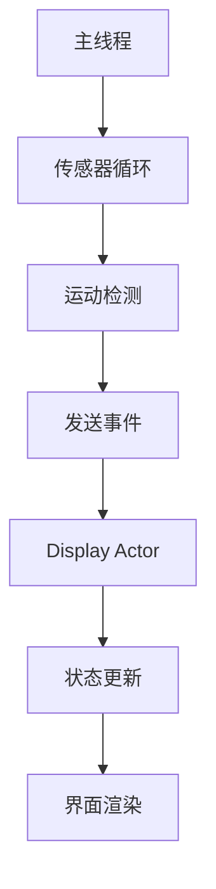

# ESP32 AI聊天助手

基于ESP32-S3的智能聊天助手项目，配备360x360像素圆形LCD显示屏和运动传感器，使用Rust语言开发。

## 项目特色

- 🎯 **360x360圆形显示屏** - ST77916驱动芯片，支持高清彩色显示
- 🎮 **运动交互** - QMI8658六轴传感器，支持摇晃和倾斜检测
- 🎨 **完整图形系统** - 九宫格布局、动画播放、多种绘图原语
- ⚡ **Actor模式架构** - 多线程设计，传感器和显示分离处理
- 🚀 **高性能渲染** - QSPI接口80MHz高速传输，DMA硬件加速

## 快速开始

### 环境要求

- Rust工具链（esp版本）
- ESP-IDF框架
- web-flash工具

### 构建项目

```bash
# 构建发布版本（推荐）
./scripts/build.sh

# 构建调试版本
./scripts/build.sh debug
```

### 刷写固件

```bash
# 刷写到ESP32设备
./scripts/flash.sh

# 刷写调试版本
./scripts/flash.sh debug
```

## 硬件规格

### 主控芯片
- **ESP32-S3** - 双核240MHz，支持WiFi和蓝牙

### 显示屏
- **尺寸**: 360x360像素圆形LCD
- **驱动**: ST77916控制器
- **接口**: QSPI四线高速传输
- **颜色**: RGB565格式，65536色

### 运动传感器
- **型号**: QMI8658六轴IMU
- **功能**: 三轴加速度计 + 三轴陀螺仪
- **接口**: I2C通信
- **特性**: 运动检测、摇晃识别、倾斜感应

### 引脚配置
```
LCD显示屏:
├── QSPI_SCK  -> GPIO40  (时钟)
├── QSPI_CS   -> GPIO21  (片选)
├── QSPI_D0   -> GPIO46  (数据0)
├── QSPI_D1   -> GPIO45  (数据1)
├── QSPI_D2   -> GPIO42  (数据2)
├── QSPI_D3   -> GPIO41  (数据3)
├── LCD_TE    -> GPIO18  (同步信号)
└── LCD_BL    -> GPIO5   (背光控制)

运动传感器:
├── I2C_SDA   -> GPIO11  (数据线)
└── I2C_SCL   -> GPIO10  (时钟线)
```

## 软件架构

### 核心模块

```
src/
├── main.rs              # 主程序入口
├── app.rs               # 应用状态机
├── actors/
│   └── display.rs       # 显示Actor线程
├── peripherals/
│   ├── st77916/         # LCD驱动
│   └── qmi8658/         # 运动传感器
└── graphics/
    ├── primitives.rs    # 绘图原语
    ├── layout.rs        # 布局系统
    ├── screens/         # 界面屏幕
    └── animation.rs     # 动画播放
```

### Actor模式设计



### 应用状态

- **欢迎界面** (`Welcome`) - 启动欢迎页面
- **主界面** (`Main`) - 聊天助手主页
- **设置界面** (`Settings`) - 系统设置页面  
- **思考状态** (`Thinking`) - AI处理动画
- **摇晃状态** (`Dizziness`) - 设备被摇晃时的特效
- **倾斜状态** (`Tilting`) - 设备倾斜时的显示
- **错误状态** (`Error`) - 错误信息显示

## 图形系统

### 九宫格布局

360x360屏幕被划分为3x3网格，每个格子120x120像素：

```
┌─────┬─────┬─────┐
│ TL  │ TC  │ TR  │  T=Top, M=Middle, B=Bottom
├─────┼─────┼─────┤  L=Left, C=Center, R=Right
│ ML  │ MC  │ MR  │
├─────┼─────┼─────┤
│ BL  │ BC  │ BR  │
└─────┴─────┴─────┘
```

### 绘图功能

- ✅ 基本图形：圆形、矩形、线条
- ✅ 文本渲染：多行文本、居中对齐
- ✅ 图像显示：BMP格式图片
- ✅ 动画播放：帧序列动画
- ✅ 颜色管理：RGB565预定义颜色

### 使用示例

```rust
use crate::graphics::{
    colors::{RED, BLUE, WHITE},
    layout::GridPosition,
    primitives::GraphicsPrimitives,
};

// 在九宫格中心绘制红色圆形
primitives.draw_circle_at_grid(GridPosition::MiddleCenter, 50, RED)?;

// 在屏幕中心显示文本
primitives.draw_text_at_center("Hello ESP32!", BLUE)?;

// 清空屏幕
primitives.fill_screen(WHITE)?;
```

## 运动交互

### 检测类型

- **静止状态** (`Still`) - 设备保持静止
- **摇晃状态** (`Shaking`) - 检测到剧烈摇晃
- **倾斜状态** (`Tilting`) - 设备倾斜超过阈值

### 交互逻辑

```rust
match motion_state {
    MotionState::Shaking => {
        // 进入摇晃特效界面
        app.enter_dizziness()
    },
    MotionState::Still => {
        // 返回主界面
        app.back()
    },
    MotionState::Tilting => {
        // 显示倾斜状态
        app.enter_tilting()
    }
}
```

## 性能优化

- **内存优化**: 分块传输减少内存占用
- **显示优化**: QSPI 80MHz高速传输
- **硬件加速**: DMA批量像素传输
- **线程分离**: Actor模式避免阻塞
- **资源嵌入**: 编译时资源打包

## 开发工具

### 调试宏

```rust
// 显示九宫格网格线
draw_debug_grid!(primitives, GRAY);

// 显示网格编号
draw_grid_numbers!(primitives, BLACK);
```

### 颜色工具

```rust
// RGB转换
let orange = rgb_to_rgb565(255, 128, 0);

// 十六进制颜色
let purple = hex_to_rgb565(0x800080);
```

## 项目结构

```
esp32-rs-std/
├── src/                 # 源代码
├── assets/              # 图片资源
│   ├── donghua/         # 动画帧
│   └── xk.bmp          # 静态图片
├── scripts/             # 构建脚本
│   ├── build.sh        # 构建脚本
│   └── flash.sh        # 刷写脚本
├── Cargo.toml          # 项目配置
├── rust-toolchain.toml # Rust工具链
└── sdkconfig.defaults  # ESP-IDF配置
```

## 故障排除

### 常见问题

**构建失败**
```bash
# 确保ESP-IDF环境已加载
source ~/Development/esp32/esp-idf/export.sh

# 检查工具链版本
rustc --version
```

**显示异常**
- 检查QSPI引脚连接
- 验证LCD初始化序列
- 确认RGB565颜色格式

**传感器无响应**
- 检查I2C引脚连接
- 验证传感器地址配置
- 确认传感器电源供应

## 贡献指南

1. Fork项目仓库
2. 创建功能分支
3. 提交代码更改
4. 推送到分支
5. 创建Pull Request

## 许可证

本项目采用MIT许可证 - 详见LICENSE文件

## 作者

- **tommy** - *项目创建者* - mzt.live@live.com

---

**⭐ 如果这个项目对你有帮助，请给个星标支持！**