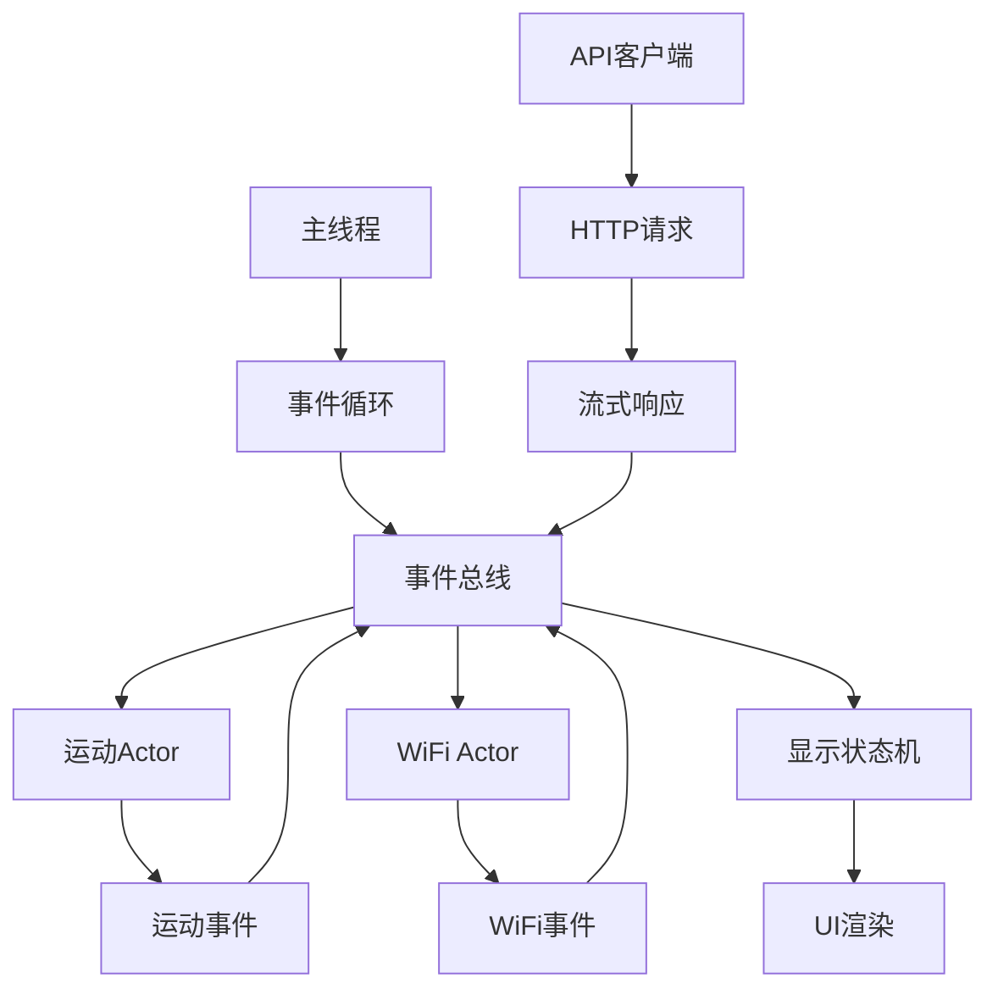

# ESP32 AI聊天助手

基于ESP32-S3的智能聊天助手项目，配备360x360像素圆形LCD显示屏和运动传感器，使用Rust语言开发。

## 项目特色

- 🎯 **360x360圆形显示屏** - ST77916驱动芯片，支持高清彩色显示
- 🎮 **运动交互** - QMI8658六轴传感器，支持摇晃和倾斜检测
- 🎨 **完整图形系统** - 九宫格布局、动画播放、多种绘图原语
- ⚡ **事件驱动架构** - 基于事件总线的actor模式，支持WiFi、API通信
- 🌐 **WiFi连接** - 支持无线网络连接和配置管理
- 🤖 **API集成** - 完整的HTTP客户端，支持流式响应和聊天功能
- 🎤 **音频支持** - I2S麦克风接口，支持语音输入
- 🚀 **高性能渲染** - QSPI接口80MHz高速传输，DMA硬件加速

## 快速开始

### 环境要求

- Rust工具链（esp版本）
- ESP-IDF框架
- web-flash工具
- WiFi网络（用于API通信）

### 构建项目

```bash
# 构建发布版本（推荐）
./scripts/build.sh

# 构建调试版本
./scripts/build.sh debug
```

### 刷写固件

```bash
# 刷写到ESP32设备
./scripts/flash.sh

# 刷写调试版本
./scripts/flash.sh debug
```

## 硬件规格

### 主控芯片
- **ESP32-S3** - 双核240MHz，支持WiFi和蓝牙

### 显示屏
- **尺寸**: 360x360像素圆形LCD
- **驱动**: ST77916控制器
- **接口**: QSPI四线高速传输
- **颜色**: RGB565格式，65536色

### 运动传感器
- **型号**: QMI8658六轴IMU
- **功能**: 三轴加速度计 + 三轴陀螺仪
- **接口**: I2C通信
- **特性**: 运动检测、摇晃识别、倾斜感应

### 音频模块
- **麦克风**: I2S数字麦克风
- **采样率**: 可配置采样率
- **接口**: I2S通信协议
- **用途**: 语音输入和命令识别

### 引脚配置
```
LCD显示屏:
├── QSPI_SCK  -> GPIO40  (时钟)
├── QSPI_CS   -> GPIO21  (片选)
├── QSPI_D0   -> GPIO46  (数据0)
├── QSPI_D1   -> GPIO45  (数据1)
├── QSPI_D2   -> GPIO42  (数据2)
├── QSPI_D3   -> GPIO41  (数据3)
├── LCD_TE    -> GPIO18  (同步信号)
└── LCD_BL    -> GPIO5   (背光控制)

运动传感器:
├── I2C_SDA   -> GPIO11  (数据线)
└── I2C_SCL   -> GPIO10  (时钟线)

音频模块:
├── I2S_SCK   -> [配置GPIO]  (时钟)
├── I2S_WS    -> [配置GPIO]  (字选择)
└── I2S_SD    -> [配置GPIO]  (数据)
```

## 软件架构

### 核心模块

```
src/
├── main.rs              # 主程序入口
├── app.rs               # 应用事件处理器
├── display.rs           # 显示状态机
├── events.rs            # 事件总线系统
├── actors/
│   ├── motion.rs        # 运动检测Actor
│   └── wifi.rs          # WiFi管理Actor
├── api/
│   ├── client.rs        # HTTP客户端
│   └── types.rs         # API类型定义
├── peripherals/
│   ├── st77916/         # LCD驱动
│   ├── qmi8658/         # 运动传感器
│   ├── microphone/      # I2S麦克风
│   └── wifi/            # WiFi管理
└── graphics/
    ├── primitives.rs    # 绘图原语
    ├── layout.rs        # 布局系统
    ├── screens/         # 界面屏幕
    └── ui/              # UI组件
```

### 事件驱动架构



### 应用状态

- **欢迎界面** (`Welcome`) - 启动欢迎页面
- **主界面** (`Main`) - 聊天助手主页
- **设置界面** (`Settings`) - 系统设置页面  
- **思考状态** (`Thinking`) - AI处理动画
- **摇晃状态** (`Dizziness`) - 设备被摇晃时的特效
- **倾斜状态** (`Tilting`) - 设备倾斜时的显示
- **错误状态** (`Error`) - 错误信息显示

### 事件类型

- **运动事件** (`MotionEvent`) - 传感器状态变化
- **WiFi事件** (`WifiEvent`) - 网络连接状态
- **系统事件** (`SystemEvent`) - 系统级别事件
- **API事件** - HTTP请求和响应处理

## 图形系统

### 九宫格布局

360x360屏幕被划分为3x3网格，每个格子120x120像素：

```
┌─────┬─────┬─────┐
│ TL  │ TC  │ TR  │  T=Top, M=Middle, B=Bottom
├─────┼─────┼─────┤  L=Left, C=Center, R=Right
│ ML  │ MC  │ MR  │
├─────┼─────┼─────┤
│ BL  │ BC  │ BR  │
└─────┴─────┴─────┘
```

### 绘图功能

- ✅ 基本图形：圆形、矩形、线条
- ✅ 文本渲染：多行文本、居中对齐
- ✅ 图像显示：BMP格式图片
- ✅ 动画播放：帧序列动画
- ✅ 颜色管理：RGB565预定义颜色

### 使用示例

```rust
use crate::graphics::{
    colors::{RED, BLUE, WHITE},
    layout::GridPosition,
    primitives::GraphicsPrimitives,
};

// 在九宫格中心绘制红色圆形
primitives.draw_circle_at_grid(GridPosition::MiddleCenter, 50, RED)?;

// 在屏幕中心显示文本
primitives.draw_text_at_center("Hello ESP32!", BLUE)?;

// 清空屏幕
primitives.fill_screen(WHITE)?;
```

## 运动交互

### 检测类型

- **静止状态** (`Still`) - 设备保持静止
- **摇晃状态** (`Shaking`) - 检测到剧烈摇晃
- **倾斜状态** (`Tilting`) - 设备倾斜超过阈值

### 事件处理

```rust
match event {
    AppEvent::Motion(motion_event) => {
        match motion_event {
            MotionEvent::Shaking => {
                // 发送摇晃事件到显示状态机
                display.handle_motion_event(motion_event)
            },
            MotionEvent::Still => {
                // 返回主界面
                display.transition_to_main()
            },
            MotionEvent::Tilting => {
                // 显示倾斜状态
                display.enter_tilting_state()
            }
        }
    }
}
```

## WiFi与API集成

### WiFi管理

```rust
// WiFi连接配置
let wifi_config = WifiConfig {
    ssid: "your-network",
    password: "your-password",
    auth_method: AuthMethod::WPA2Personal,
};

// 连接WiFi
wifi_actor.connect(wifi_config).await?;
```

### API客户端

```rust
// HTTP API调用
let client = ApiClient::new();
let response = client.send_chat_message("Hello AI!").await?;

// 处理流式响应
for event in response.events() {
    match event {
        SseEvent::Data(data) => {
            // 处理接收到的数据
            display.update_chat_content(data);
        }
        SseEvent::Done => {
            // 响应完成
            display.set_thinking_complete();
        }
    }
}
```

## 性能优化

- **内存优化**: 分块传输减少内存占用
- **显示优化**: QSPI 80MHz高速传输
- **硬件加速**: DMA批量像素传输
- **事件驱动**: 异步事件处理避免阻塞
- **资源嵌入**: 编译时资源打包
- **网络优化**: 异步HTTP客户端和连接池
- **数据流**: 流式API响应处理

## 开发工具

### 调试宏

```rust
// 显示九宫格网格线
draw_debug_grid!(primitives, GRAY);

// 显示网格编号
draw_grid_numbers!(primitives, BLACK);
```

### 颜色工具

```rust
// RGB转换
let orange = rgb_to_rgb565(255, 128, 0);

// 十六进制颜色
let purple = hex_to_rgb565(0x800080);
```

## 项目结构

```
esp32-rs-std/
├── src/                 # 源代码
├── assets/              # 图片资源
│   ├── donghua/         # 动画帧
│   └── xk.bmp          # 静态图片
├── scripts/             # 构建脚本
│   ├── build.sh        # 构建脚本
│   └── flash.sh        # 刷写脚本
├── Cargo.toml          # 项目配置
├── rust-toolchain.toml # Rust工具链
└── sdkconfig.defaults  # ESP-IDF配置
```

## 故障排除

### 常见问题

**构建失败**
```bash
# 确保ESP-IDF环境已加载
source ~/Development/esp32/esp-idf/export.sh

# 检查工具链版本
rustc --version
```

**显示异常**
- 检查QSPI引脚连接
- 验证LCD初始化序列
- 确认RGB565颜色格式

**传感器无响应**
- 检查I2C引脚连接
- 验证传感器地址配置
- 确认传感器电源供应

**WiFi连接失败**
- 检查网络配置文件
- 确认WiFi凭据正确
- 验证网络信号强度
- 检查路由器设置

**API调用失败**
- 检查网络连接状态
- 验证API端点配置
- 确认请求格式正确
- 检查超时设置

## 贡献指南

1. Fork项目仓库
2. 创建功能分支
3. 提交代码更改
4. 推送到分支
5. 创建Pull Request

## 许可证

本项目采用MIT许可证 - 详见LICENSE文件

## 作者

- **tommy** - *项目创建者* - mzt.live@live.com

---

**⭐ 如果这个项目对你有帮助，请给个星标支持！**